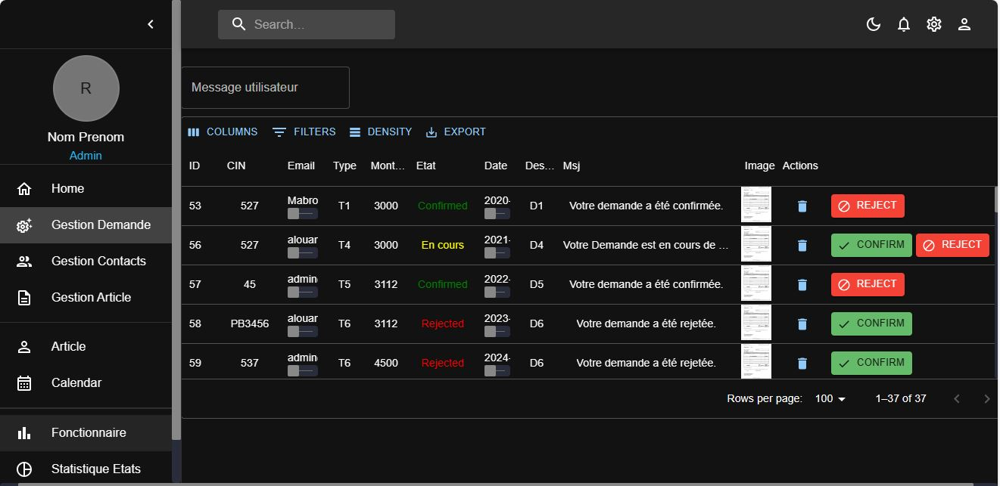
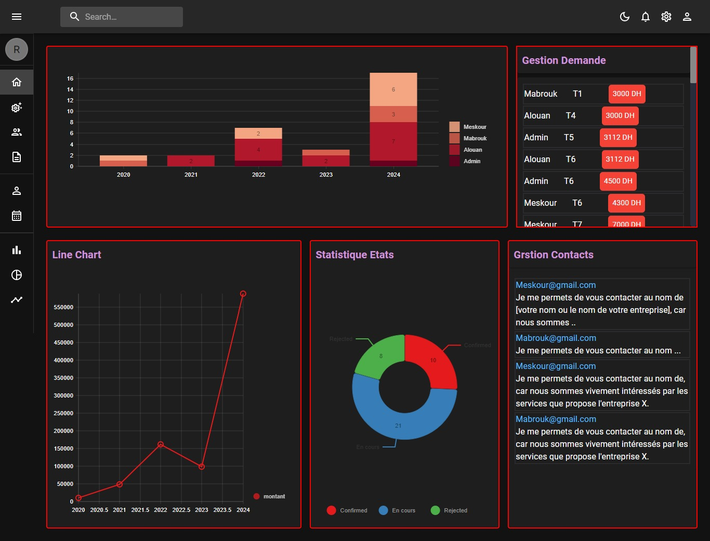

## Aplication interface

<div align="center"> 
   
     &nbsp;&nbsp;&nbsp;&nbsp;
    
</div> 

### Introduction

This project offers a user-friendly solution for managing travel expenses, reducing costs, and ensuring transparency. It enhances user experience, strengthens employee satisfaction, and ensures regulatory compliance. Training sessions facilitate effective adoption, maximizing benefits and adding significant value to the company.

### 🎉 [NEW] Horizon UI Components
All the main components from both versions, this will help you to see and interact with all & the latest added components of Horizon (also, new components are on the way, stay tuned)! ⚡️
<a href="https://horizon-ui.com/components/?ref=readme-horizon" target="_blank">See all components</a>


### Documentation

Each element is well presented in a very complex documentation. You can read
more about the <a href="https://horizon-ui.com/documentation/docs/introduction?ref=readme-horizon" target="_blank">documentation
here.</a>

### Quick Start

Install Horizon UI by running either of the following:

- Install NodeJS LTS from
  [NodeJs Official Page](https://nodejs.org/en/?ref=horizon-documentation)
  (NOTE: Product only works with LTS version)

Clone the repository with the following command:

```bash
git clone https://github.com/horizon-ui/horizon-ui-chakra.git
```

Run in terminal this command:

```bash
npm install
```

Then run this command to start your local server

```bash
npm start
```
